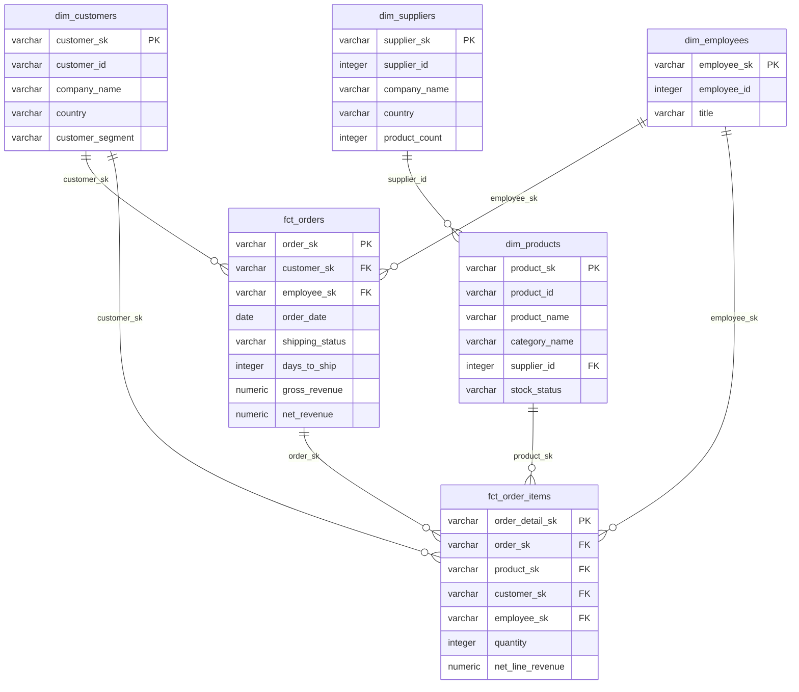
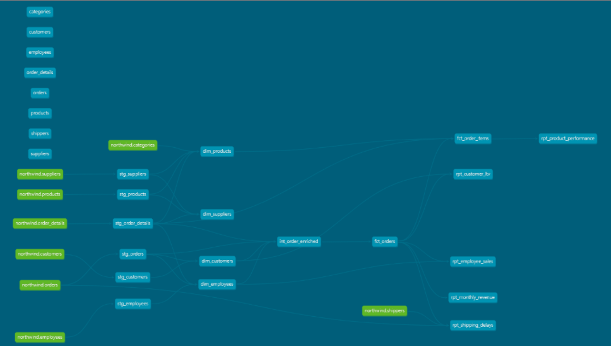

# SQL-Only Analytics Engineering

**dbt Core · DuckDB · Star Schema · Automated Testing**

### 🔗 [**Live Dashboard**](https://northwind-analytics-pat.netlify.app) &nbsp;·&nbsp; [Source on GitHub](https://github.com/PloypairaohPat/sql-analytics-engineering-project)

A complete analytics engineering pipeline built with only SQL and dbt — 18 models across 5 architectural layers, 127 automated schema tests, and a published lineage DAG. The [live Evidence.dev dashboard](https://northwind-analytics-pat.netlify.app) answers 3 of the 5 business questions below, built from the same SQL models — no Python anywhere in the stack.

---

## Architecture Overview

```
RAW SEEDS → STAGING → INTERMEDIATE → DIMENSIONS + FACTS → REPORTING MARTS
```

| Layer | Models | Count | Materialisation |
|---|---|---|---|
| Staging | stg_orders, stg_customers, stg_products, stg_employees, stg_order_details, stg_suppliers | 6 | view |
| Dimensions | dim_customers, dim_products, dim_employees, dim_suppliers | 4 | table |
| Facts | fct_orders, fct_order_items | 2 | incremental |
| Reporting | rpt_monthly_revenue, rpt_customer_ltv, rpt_product_performance, rpt_employee_sales, rpt_shipping_delays | 5 | table |
| Intermediate | int_order_enriched | 1 | view |
| **Total** | | **18** | |

---

## Dimensional Model (Star Schema)

Two fact tables at different grains — `fct_orders` (one row per order) and `fct_order_items` (one row per order line) — radiate out to four conformed dimensions.



*`fct_order_items` carries `customer_sk` and `employee_sk` through from the order grain so the line-item fact can be sliced by customer or employee without a fact-to-fact join. Suppliers attach to the products dimension on the natural key `supplier_id` — a small snowflake off `dim_products`, kept this way because supplier attributes are stable and low-cardinality. Categories are denormalised directly into `dim_products` rather than split into a separate dimension.*

---

## Stack

- **dbt Core 1.11** — SQL model orchestration, dependency resolution, testing, docs
- **DuckDB 1.10** — zero-config in-process analytical database
- **dbt_utils 1.3** — surrogate key generation (`generate_surrogate_key`)
- **Northwind dataset** — 8 related CSV tables, 830 orders, 2,155 line items, 91 customers

---

## Key SQL Techniques Demonstrated

| Technique | Where Used |
|---|---|
| `ROW_NUMBER() QUALIFY` deduplication | All staging models |
| `RANK() OVER(...)` | rpt_product_performance, rpt_employee_sales, rpt_customer_ltv |
| `NTILE(4) OVER(...)` quartile segmentation | rpt_customer_ltv |
| `LAG()` month-over-month comparison | rpt_monthly_revenue |
| `SUM() OVER (ORDER BY ...)` running totals | rpt_monthly_revenue, rpt_customer_ltv |
| Incremental materialisation with 3-day lookback | fct_orders, fct_order_items |
| Surrogate key generation | All staging models |
| Multi-step CTE chains | All models |
| `datediff()` date arithmetic | stg_orders, dim_customers, dim_employees |

---

## Test Results

```
dbt test: 127 passed, 0 warnings, 0 errors
```

Tests cover:
- `not_null` + `unique` on every primary key
- `relationships` on every foreign key
- `accepted_values` on every status/enum column

---

## Business Questions Answered

### Q1 — How is revenue trending month over month?

April 1998 was the peak revenue month at **$123,799** across 74 orders, capping a run of consistently positive month-over-month growth through early 1998 — February 1998 grew +5.8% over January.

| Month | Revenue | Orders |
|---|---|---|
| Apr 1998 | $123,799 | 74 |
| Mar 1998 | $104,854 | 73 |
| Feb 1998 | $99,415 | 54 |
| Jan 1998 | $94,222 | 55 |
| Dec 1997 | $71,398 | 48 |

### Q2 — Who are the most valuable customers?

The top quartile of customers accounts for a disproportionate share of revenue. The top 3 customers alone represent over **$319K** in lifetime value:

| Customer | Country | LTV | Orders |
|---|---|---|---|
| QUICK-Stop | Germany | $110,277 | 28 |
| Ernst Handel | Austria | $104,875 | 30 |
| Save-a-lot Markets | USA | $104,362 | 31 |
| Rattlesnake Canyon Grocery | USA | $51,098 | 18 |
| Hungry Owl All-Night Grocers | Ireland | $49,980 | 19 |

### Q3 — Which products and categories perform best?

**Beverages** is the top revenue category. Côte de Blaye alone generates **$141,397** — nearly twice the second-best product — despite having lower unit volume than Raclette Courdavault.

| Rank | Product | Category | Revenue | Units Sold |
|---|---|---|---|---|
| 1 | Côte de Blaye | Beverages | $141,397 | 623 |
| 2 | Thüringer Rostbratwurst | Meat/Poultry | $80,369 | 746 |
| 3 | Raclette Courdavault | Dairy Products | $71,156 | 1,496 |
| 4 | Tarte au sucre | Confections | $47,235 | 1,083 |
| 5 | Camembert Pierrot | Dairy Products | $46,825 | 1,577 |

### Q4 — Who are the top-performing sales reps?

Margaret Peacock leads both by total revenue (**$232,891**) and order count (156 orders). Rankings by revenue and by orders are largely consistent — the top 3 by revenue are also the top 3 by order count.

| Rank | Employee | Revenue | Orders |
|---|---|---|---|
| 1 | Margaret Peacock | $232,891 | 156 |
| 2 | Janet Leverling | $202,813 | 127 |
| 3 | Nancy Davolio | $192,108 | 123 |
| 4 | Andrew Fuller | $166,538 | 96 |
| 5 | Laura Callahan | $126,862 | 104 |

### Q5 — Which countries and shippers have the worst delivery performance?

Argentina has the worst on-time rate at **81.25%** though with a small sample. Ireland (84.2%) and Venezuela (89.1%) are the next worst. Average days to ship ranges from 7.9 to 11.0 for the worst performers.

| Country | On-Time % | Late Orders | Avg Days to Ship |
|---|---|---|---|
| Argentina | 81.25% | 1 | 9.3 |
| Ireland | 84.21% | 3 | 11.0 |
| Venezuela | 89.13% | 2 | 8.5 |
| Italy | 89.29% | 2 | 7.9 |
| USA | 91.80% | 7 | 9.6 |

---

## dbt Docs & Lineage DAG

Generate and serve docs locally:

```bash
# From northwind_analytics/ directory
dbt docs generate --profiles-dir . --project-dir .
dbt docs serve --profiles-dir . --project-dir .
# Opens at http://localhost:8080
# Navigate to any model → click the graph icon to view the lineage DAG
```

The full lineage DAG shows the dependency chain:
```
seeds (8 tables)
  └─ staging (6 models)
       └─ intermediate (int_order_enriched)
            ├─ dimensions (4 models)
            ├─ facts/fct_orders (incremental)
            │    └─ facts/fct_order_items (incremental)
            └─ reporting (5 models)
```



---

## Project Structure

```
northwind_analytics/
├── dbt_project.yml          # Materialisation config per layer
├── packages.yml             # dbt_utils dependency
├── profiles.yml             # DuckDB connection
├── seeds/                   # 8 Northwind CSV files
├── models/
│   ├── staging/             # stg_* models + sources.yml + schema.yml
│   ├── intermediate/        # int_order_enriched + schema.yml
│   ├── dimensions/          # dim_* models + schema.yml
│   ├── facts/               # fct_* models (incremental) + schema.yml
│   └── reporting/           # rpt_* models + schema.yml
└── macros/
```

---

## Setup & Run

```bash
# 1. Create a Python 3.10 virtual environment
python3.10 -m venv .venv

# Activate it:
#   Windows (PowerShell):  .venv\Scripts\Activate.ps1
#   macOS / Linux:         source .venv/bin/activate

# Install dbt
python -m pip install dbt-duckdb

# 2. Install packages
dbt deps --profiles-dir northwind_analytics --project-dir northwind_analytics

# 3. Load seed data
dbt seed --profiles-dir northwind_analytics --project-dir northwind_analytics

# 4. Build all 18 models and run all 127 tests
#    (dbt build interleaves run + test in DAG order — what production teams do)
dbt build --profiles-dir northwind_analytics --project-dir northwind_analytics

# 5. Generate and serve docs
dbt docs generate --profiles-dir northwind_analytics --project-dir northwind_analytics
dbt docs serve --profiles-dir northwind_analytics --project-dir northwind_analytics
```

---